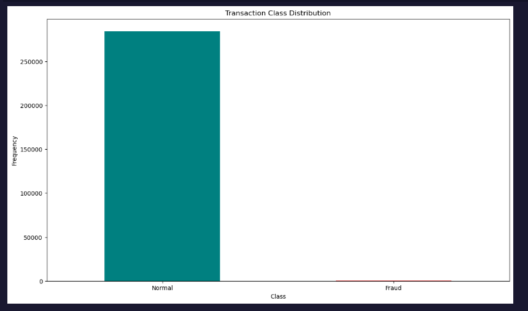
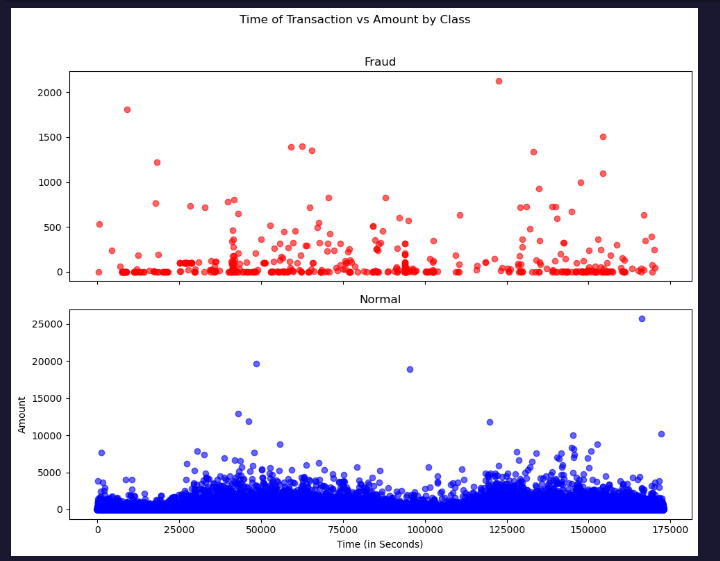
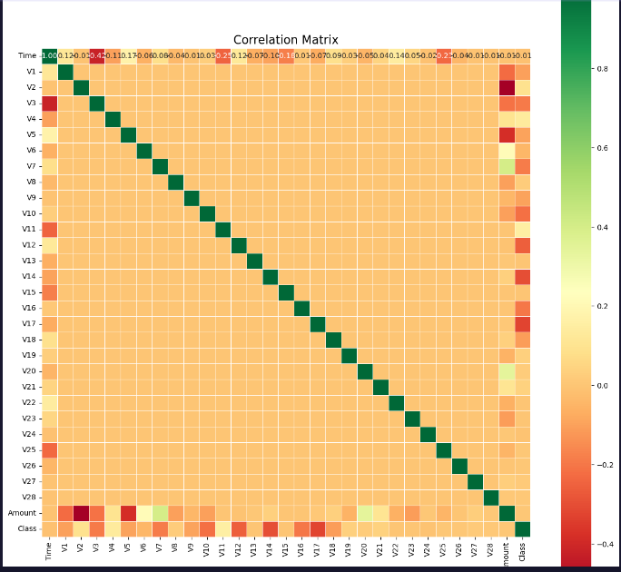

# Credit Card Kaggle Anomaly Detection

## Context

It is important that credit card companies are able to recognize fraudulent credit card transactions so that customers are not charged for items that they did not purchase.

## Content

The dataset contains transactions made by credit cards in **September 2013** by European cardholders. This dataset presents transactions that occurred over **two days**, where we have **492 frauds** out of **284,807 transactions**.

The dataset is highly unbalanced, as the positive class (frauds) accounts for only **0.172%** of all transactions.

### Key Details:

- The dataset contains only **numerical input variables**, which are the result of a **PCA transformation**.
- Due to confidentiality issues, the original features and more background information about the data are unavailable.
- **Features**:
  - **V1, V2, ..., V28**: Principal components obtained via PCA.
  - **Time**: Seconds elapsed between each transaction and the first transaction in the dataset.
  - **Amount**: Transaction amount, which can be used for cost-sensitive learning.
  - **Class**: Response variable (1 = Fraud, 0 = Normal).

## Inspiration

The goal is to identify fraudulent credit card transactions.

### Evaluation Metric:

Given the class imbalance ratio, it is recommended to measure accuracy using the **Area Under the Precision-Recall Curve (AUPRC)**. Confusion matrix accuracy is not meaningful for unbalanced classification.

## Acknowledgements

The dataset has been collected and analyzed during a research collaboration between **Worldline** and the **Machine Learning Group (http://mlg.ulb.ac.be)** of **ULB (Université Libre de Bruxelles)** on big data mining and fraud detection.

More details on current and past projects on related topics are available:

- [ResearchGate: Fraud Detection Project](https://www.researchgate.net/project/Fraud-detection-5)
- [DefeatFraud Project Page](https://www.researchgate.net/project/Fraud-detection-5)
  
  
  

## Isolation Forest Algorithm

One of the newest techniques for detecting anomalies is called **Isolation Forests**. The algorithm is based on the fact that anomalies are data points that are few and different. Due to these properties, anomalies are susceptible to a mechanism called **isolation**.

This method is highly useful and fundamentally different from existing anomaly detection methods. It introduces the use of isolation as a more effective and efficient means of detecting anomalies than the commonly used distance and density-based measures. Moreover, this method has **low linear time complexity** and **small memory requirements**, which makes it highly scalable. It can build a high-performing model with a small number of trees using small sub-samples of fixed size, regardless of the dataset's size.

### How Isolation Forests Work

The **Isolation Forest** algorithm isolates observations by:

1. Randomly selecting a feature.
2. Randomly selecting a split value between the maximum and minimum values of the selected feature.

The key idea is that **isolating anomaly observations is easier** because only a few conditions are needed to separate them from normal observations. In contrast, isolating normal observations requires more conditions. Therefore, an **anomaly score** is calculated based on the number of conditions needed to isolate a given observation.

The algorithm constructs the separation by first creating **isolation trees** (random decision trees). The score is then calculated based on the path length required to isolate the observation.

---

## Local Outlier Factor (LOF) Algorithm

The **LOF (Local Outlier Factor)** algorithm is an unsupervised outlier detection method that computes the **local density deviation** of a given data point with respect to its neighbors. It considers as outliers those samples that have a substantially lower density than their neighbors.

The number of neighbors considered (`n_neighbors` parameter) is typically chosen such that:

1. It is greater than the minimum number of objects a cluster must contain, so other objects can be local outliers relative to this cluster.
2. It is smaller than the maximum number of nearby objects that could potentially be local outliers.

In practice, such information is often not available, and a common choice is `n_neighbors = 20`, which generally works well in most cases.

n.

### Local Outlier Factor(LOF) Algorithm

The LOF algorithm is an unsupervised outlier detection method which computes the local density deviation of a given data point with respect to its neighbors. It considers as outlier samples that have a substantially lower density than their neighbors.

The number of neighbors considered, (parameter n_neighbors) is typically chosen 1) greater than the minimum number of objects a cluster has to contain, so that other objects can be local outliers relative to this cluster, and 2) smaller than the maximum number of close by objects that can potentially be local outliers. In practice, such informations are generally not available, and taking n_neighbors=20 appears to work well in general.

#### Observations :

- Isolation Forest detected 73 errors versus Local Outlier Factor detecting 97 errors vs. SVM detecting 8516 errors
- Isolation Forest has a 99.74% more accurate than LOF of 99.65% and SVM of 70.09
- When comparing error precision & recall for 3 models , the Isolation Forest performed much better than the LOF as we can see that the detection of fraud cases is around 27 % versus LOF detection rate of just 2 % and SVM of 0%.
- So overall Isolation Forest Method performed much better in determining the fraud cases which is around 30%.
- We can also improve on this accuracy by increasing the sample size or use deep learning algorithms however at the cost of computational expense.We can also use complex anomaly detection models to get better accuracy in determining more fraudulent cases
